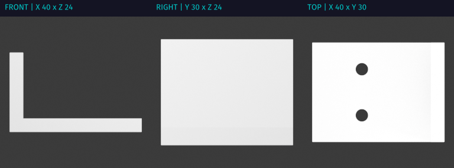

# Printable

Printable lets an HTTP MCP client build 3D models with Blender and OpenSCAD,
inspect dimensions and mesh geometry, and retrieve printable STL files,
rendered images, Blender checkpoints, and videos.

It runs on a self-hosted Linux/amd64 machine with an NVIDIA GPU. A live Blender
process handles modeling and visual feedback; a separate background worker
renders saved checkpoints. No model provider or gateway is required by the
server. You supply the MCP client.

The repository is currently private while independent installation and release
qualification are completed. Development is maintained on
[GitHub](https://github.com/chrisbennight/mcp-printable-rs).

## Get started

Follow the [installation guide](docs/installation.md) to build the matching
images, create a local credential, and start the three services with Compose.
Then run the bracket tutorial:

```sh
python3 scripts/quickstart.py .dev/first-bracket
```

The tutorial creates a bracket, checks its mesh, renders dimensioned views,
saves a checkpoint, and downloads STL, PNG, BLEND, and MP4 files. It records the
validation and job results alongside those files. It saves the previous live
scene before replacing it for the tutorial.



This image was generated by the tutorial. Dimensions are in millimetres; see
the [recorded artifact evidence](evidence/quickstart-artifacts.md).

## What you can do

- Model with typed scene operations, OpenSCAD source, or deliberate Blender Python.
- Inspect scene structure and native viewport or editor images before editing.
- Measure mesh bounds, topology, overhangs, and clearance between rigid parts.
- Render previews, product views, galleries, and restart-recoverable video jobs.
- Transfer workspace artifacts directly without putting file bytes into chat.

The [workflow interface](docs/workflow-interface.md) lists the tools and actions.
The [modeling guide](crates/printable-server/resources/blender-modeling-v1.md)
explains inspection, checkpoints, and safe recovery from uncertain requests.
[Reference products](acceptance/products) demonstrate the reusable OpenSCAD kit.

## Boundaries

This is a shared service for a trusted person or team. The bearer grants access
to the shared scene and workspace, including Python execution inside Blender.
It does not provide tenant isolation or a Python sandbox. Keep Blender's bridge
private and use HTTPS for remote MCP access.

Mesh reports establish the measurements they describe. A rendered image does
not certify wall thickness, strength, or printability, and a motion animation
does not prove clearance. Review the evidence and your printer and material
requirements before manufacturing a part.

NVIDIA is the supported graphics path. Software rendering in CI checks code and
container behavior; it does not qualify a GPU release. Separate Blender
processes still share physical GPU resources.

## Project information

- [Architecture](docs/architecture.md), [operations](docs/operations.md), and [render recovery](docs/render-worker.md)
- [Contributing](CONTRIBUTING.md) and [continuous integration](docs/continuous-integration.md)
- [Security and reporting](SECURITY.md)
- [License and bundled components](THIRD_PARTY_NOTICES.md)
- [Publication scope and retained history](docs/publication.md)

First-party source uses the [MIT license](LICENSE). Bundled software and fonts
retain their own licenses; the container images are not wholly MIT-licensed.
