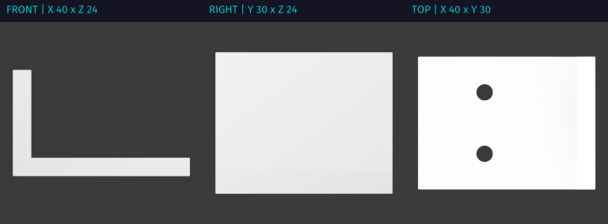

# Printable

Printable lets an HTTP MCP client build 3D models with Blender, OpenSCAD, and CadQuery,
inspect dimensions and mesh geometry, and retrieve printable STL files,
rendered images, Blender checkpoints, and videos.

It runs on a self-hosted Linux/amd64 machine with an NVIDIA GPU. A live Blender
process handles modeling and visual feedback; a separate background worker
renders saved checkpoints. No model provider or gateway is required by the
server. You supply the MCP client.

Development is maintained publicly on
[GitHub](https://github.com/chrisbennight/mcp-printable-rs).
See [continuous integration](docs/continuous-integration.md) for source checks
and automatic image publication after merges to `main`.

## Get started

Follow the [installation guide](docs/installation.md) to build the matching
images, create a local credential, and start the four runtime services with Compose.
Then run the bracket tutorial:

```sh
python3 scripts/quickstart.py .dev/first-bracket
```

The tutorial creates a bracket, checks its mesh, renders dimensioned views,
saves a checkpoint, and downloads STL, PNG, BLEND, and MP4 files. It records the
validation and job results alongside those files. It saves the previous live
scene before replacing it for the tutorial.



This image was generated by the tutorial. Dimensions are in millimetres; see
the [recorded artifact evidence](evidence/quickstart-artifacts.md).

## What you can do

- Model with typed scene operations, OpenSCAD source, or deliberate Blender Python.
- Build project CAD sources and convert STEP assemblies with a separate native worker.
- Inspect scene structure and native viewport or editor images before editing.
- Measure mesh bounds, topology, overhangs, and clearance between rigid parts.
- Render previews, product views, galleries, and restart-recoverable video jobs.
- Transfer workspace artifacts directly without putting file bytes into chat.
- Load the [image to mold skill](docs/image-to-mold.md) for calibrated relief maps,
  positive masters, silicone casting trays, and negative cavities.

The [workflow interface](docs/workflow-interface.md) lists the public
tools and their typed actions. The [product refactor](docs/product-refactor.md)
records delivery intent and acceptance criteria; deployment verification is
tracked separately from implementation and merge.
The [modeling guide](crates/printable-server/resources/blender-modeling-v1.md)
explains inspection, checkpoints, and safe recovery from uncertain requests.
[Reference products](acceptance/products) demonstrate the reusable OpenSCAD kit.

## Optional print failure detection

The `obico` Compose profile runs the upstream Obico ML API as `obico-ml`.
Bambuddy's existing failure detection captures camera frames, checks them with
the ML API, and handles notifications and configured printer actions. Configure
it in Bambuddy; Printable requires no additional API settings for detection.
The image is pinned by digest and retains Obico's
[AGPL-3.0 license](https://github.com/TheSpaghettiDetective/obico-server/blob/release/LICENSE).

After the regular installation, start the service with NVIDIA access:

```sh
docker compose --env-file .dev/compose.env -f compose.yaml -f compose.obico-gpu.yaml --profile obico up -d --wait obico-ml
```

The upstream image includes GPU and CPU runtimes and attempts GPU inference
first. To run that same image on CPU, omit the GPU override:

```sh
docker compose --env-file .dev/compose.env --profile obico up -d --wait obico-ml
```

Docker needs NVIDIA support to start a service with a GPU reservation. If that
is unavailable, use the CPU command. Check `obico-ml` logs for the backend that
actually loaded; a healthy API alone does not establish GPU execution. The
service has a separate memory limit and shares the selected GPU with Blender
when the override is used.

The pinned image has passed isolated CPU health and authenticated inference
checks with this configuration. NVIDIA hardware execution has not been
qualified; verify the loaded GPU backend on your host before relying on it.

The service has no published port. Its internal network is named
`printable-printers`; `PRINTABLE_OBICO_NETWORK` can select another name. Attach
Bambuddy to that network so it can resolve `obico-ml`, and the ML API can fetch
Bambuddy's cached camera frames. For a Bambuddy service using Compose bridge
networking, merge this into its Compose file while retaining its existing
networks:

```yaml
services:
  bambuddy:
    networks: [default, printable-printers]

networks:
  printable-printers:
    external: true
    name: printable-printers
```

Use the same network name in both deployments, then recreate the Bambuddy
service to apply its network configuration. In Bambuddy:

| Setting | Value |
| --- | --- |
| Settings → Failure Detection → Obico ML API URL | `http://obico-ml:3333` |
| Settings → Network → External URL | A Bambuddy URL reachable from the ML container, such as `http://bambuddy:8000` on this network |
| ML API Token | Leave empty unless the ML service has a token configured |
| Enable, monitored printers, sensitivity, and action | Choose in Bambuddy; start with **Notify only** |

The External URL also supplies notification links; choose an address reachable
by recipients when using those links. An authenticated reverse proxy must
allow the temporary `/api/v1/obico/cached-frame/` URLs to reach Bambuddy.
Use Bambuddy's **Test** button, and enable the **AI Failure Detection** event
on the notification providers you select. See
[Bambuddy's setup guide](https://wiki.bambuddy.cool/features/failure-detection/)
for tuning and monitoring status.

Token authentication is optional on this private service. If desired, inject
`PRINTABLE_OBICO_ML_API_TOKEN` through the process environment or the private
`.dev/compose.env` file; Compose passes it as Obico's `ML_API_TOKEN`. Set the
same value in Bambuddy's **ML API Token** field. Keep credential values out of
the checked-in environment example and logs. `PRINTABLE_OBICO_IMAGE` can
override the image with another verified upstream digest.

## Boundaries

This is a shared service for a trusted person or team. The bearer grants access
to the shared scene and workspace, including Python execution inside Blender.
It does not provide tenant isolation or a Python sandbox. Keep Blender's bridge
private and use HTTPS for remote MCP access.

Mesh reports establish the measurements they describe. A rendered image does
not certify wall thickness, strength, or printability, and a motion animation
does not prove clearance. Review the evidence and your printer and material
requirements before manufacturing a part.

NVIDIA is the supported graphics path. Software rendering in CI checks code and
container behavior; it does not measure GPU performance. Separate Blender
processes still share physical GPU resources.

## Project information

- [Architecture](docs/architecture.md), [operations](docs/operations.md), and [render recovery](docs/render-worker.md)
- [Contributing](CONTRIBUTING.md) and [continuous integration](docs/continuous-integration.md)
- [Security and reporting](SECURITY.md)
- [License and bundled components](THIRD_PARTY_NOTICES.md)
- [Publication scope and retained history](docs/publication.md)

First-party source uses the [MIT license](LICENSE). Bundled software and fonts
retain their own licenses; the container images are not wholly MIT-licensed.
