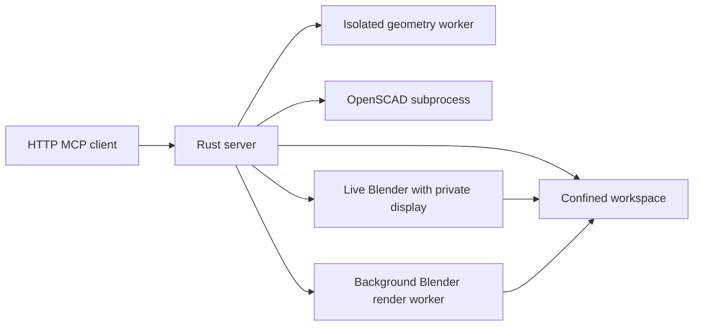

# Architecture

Printable exposes streamable HTTP MCP at `/mcp`. The Rust server validates
transport authority, resolves a workflow action into typed parameters, and
dispatches work to geometry code, OpenSCAD, or a private Blender bridge. Files
stay under a dedicated workspace root. The MCP client receives bounded results
and file descriptors rather than whole videos or models encoded into chat.

The six Cargo crates separate concerns with different failure and testing
boundaries:

| Crate | Responsibility |
| --- | --- |
| `printable-server` | HTTP, MCP dispatch, job persistence, and file transfer |
| `printable-blender` | Length-prefixed JSON bridge, deadlines, and process identity |
| `printable-geom` | Pure mesh measurements and printability analysis |
| `printable-scad` | Confined source validation and OpenSCAD subprocesses |
| `printable-workspace` | Capability-rooted artifact I/O and atomic promotion |
| `printable-imaging` | Bounded image decoding and composition |

The first-party code in `addon/` executes inside Blender. Its supervisor and
main-thread bridge serialize scene operations and recover from a stalled
process. UI mode uses a private authenticated display for native viewport and
editor observations. Neither Blender process exposes a public control port.

## State and failure boundaries

Live scene changes are separate from durable render jobs. Callers save a
checkpoint before job submission. The server snapshots and hashes it before
queueing work; the background worker verifies it before loading. Jobs persist
frame progress and encode verified frames into MP4. Restart recovery never
replaces the live scene for new isolated jobs. External files not packed into
the checkpoint remain the caller's responsibility.

The bridge may time out after a mutation has happened. That outcome is unknown,
so clients must inspect state or restore a checkpoint before deciding whether
to retry. Optional scene preconditions reject stale edits at Blender's
serialized command boundary. See [scene state](scene-state.md) and
[render recovery](render-worker.md) for these contracts.

Geometry analysis shares a bounded execution lane. Exact constructive geometry
runs in a disposable process with an address-space limit. OpenSCAD uses argv
arguments, restricted source, snapshotted file inputs, and caller work budgets.
These boundaries contain failures without granting the server control over
unrelated workloads.

File publication snapshots an artifact, records its size and digest, and issues
a short-lived one-use HTTP grant. The MCP bearer is not the download grant.
Clients verify streamed bytes before accepting the file. Proxy URL settings
come from trusted configuration, not forwarded request headers.

## Current design and historical records

The [workflow interface](workflow-interface.md), [native observations](native-observation.md),
and [render-worker guide](render-worker.md) describe current behavior.
`PLAN.md`, `DECISIONS.md`, the imported deployment notes, and the
[imported README](history/imported-readme.md) retain the project's earlier
delivery and lab deployment history. They are not standalone installation
instructions. New work is tracked in GitHub issues.

Do not split modules solely to reduce their line count. Extract a boundary when
it makes authority, ownership, testing, or failure handling clearer. Preserve
the public workflow contract while changing internal implementation names.
